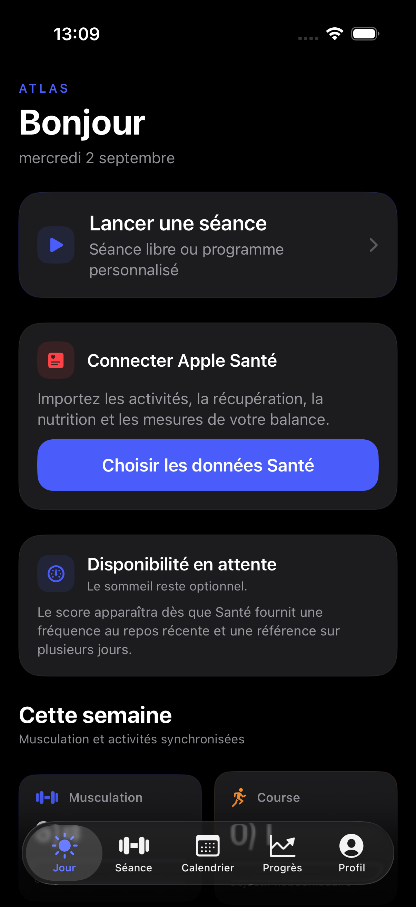
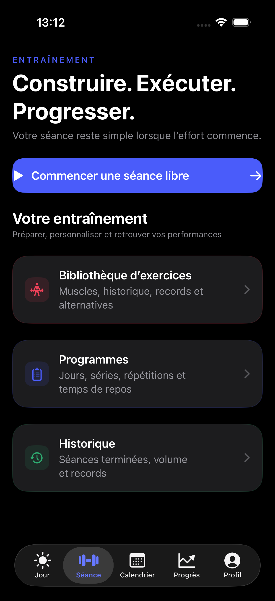
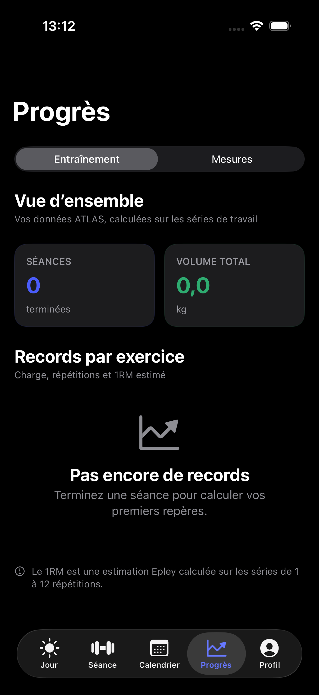

# ATLAS

Je voulais une app simple et complète pour gérer mes séances de musculation, suivre ma progression et réunir mes données sportives au même endroit. **ATLAS** est cette app : un coach sportif personnel natif pour iPhone, local-first, sans compte obligatoire et open source.

<p align="center">
  
  
  
</p>

## Open source

Le code source d’ATLAS est publié sous [licence MIT](LICENSE). Les données personnelles restent sur l’appareil ; les connexions à Apple Santé et au scanner de codes-barres sont facultatives et déclenchées uniquement par une action explicite.

## Transparence sur l’IA

Ce projet et sa vidéo de présentation ont été réalisés avec l’aide de **GPT-5.6 Sol**. L’IA a servi d’assistant pour la conception, l’implémentation, la vérification et la production de la présentation ; les choix de produit et la responsabilité du résultat restent humains. Cette mention ne signifie pas qu’ATLAS intègre une fonctionnalité d’IA à l’exécution.

## Open the app

1. Install a complete Xcode release with the iOS 17+ SDK.
2. Open `ATLAS.xcodeproj`.
3. Select an iPhone simulator and run the `ATLAS` scheme.

Use Product → Test in Xcode to run the `ATLASTests` and `ATLASUITests` targets against the app module.

The app seeds an additive bilingual catalog of 214 exercises on first launch without replacing custom exercises. Apple Health access is optional, read-only and requested only after an explicit action. Camera access is requested only when the barcode scanner opens; Open Food Facts is contacted only for a product lookup.

## Current strength-tracker features

- searchable/filterable bilingual library of 214 exercises, plus custom exercises;
- illustrated muscle map with broad regions (arms, back, legs…) and precise subcategories such as biceps, forearms, lats, traps, adductors and obliques;
- user-authored programs, days and prescriptions;
- program duplication and confirmed deletion;
- free workouts and workouts created from a program day;
- exercise replacement inside a draft workout;
- weight, repetitions, RIR, RPE, duration, distance and notes;
- full right-swipe set deletion with immediate reindexing and persistence;
- recent performance, deterministic progression suggestion and estimated 1RM;
- rest timer with a quick 15-second extension;
- workout history and one-tap repeat with previous values prefilled;
- recoverable persistence feedback instead of silent save failures;
- complete versioned JSON export and completed-set CSV export;
- explicit deletion of all personal ATLAS data with restoration of the bundled catalog;
- optional read-only Apple Health connection for Mi Fitness-synchronized metrics and workouts;
- weekly strength, running, cycling, swimming and basketball dashboard with data provenance;
- deterministic readiness from sleep and resting-heart-rate inputs, with explicit missing-data states;
- nutrition journal, configurable energy/macronutrient goals and seven-day trends;
- Foodvisor nutrition read through Apple Health without a Foodvisor account inside ATLAS;
- barcode scanning with editable Open Food Facts values, attribution and a local product cache;
- Strava/Mi Fitness workout reconciliation so one real-world activity is counted once while its sources remain visible;
- weekly sports calendar combining completed ATLAS sessions with reconciled HealthKit activities and their duration, distance, calories and contributing sources;
- SwiftData V2 migration preserving existing V1 training data and adding nutrition entries;
- explicit SwiftData V1/V2 schemas and tested lightweight migration;
- local SwiftData persistence with memory, disk-reopen and 1,000-workout performance tests;
- an automated exercise → program → workout → history UI flow;
- an automated Dark Mode and accessibility-size launch check.

## Run domain tests

```sh
swift test
```

The command-line package compiles only `ATLAS/Core`, keeping analytics and progression tests independent of SwiftUI, SwiftData and a simulator.

The complete iOS suite can be run from Xcode with Product → Test. The critical UI test uses an isolated in-memory store, so it does not alter personal simulator data.

If the machine has only Command Line Tools and SwiftPM itself is unavailable, the same pure-core checks can be compiled directly:

```sh
swiftc -warnings-as-errors ATLAS/Core/*.swift Tests/CoreTestRunner.swift -o /tmp/atlas-core-tests
/tmp/atlas-core-tests
```

## Design documents

- `PRODUCT_SPEC.md`
- `ARCHITECTURE.md`
- `PRIVACY.md`
- `ROADMAP.md`
- `RELEASE_CHECKLIST.md`
